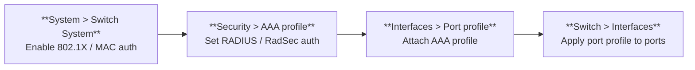
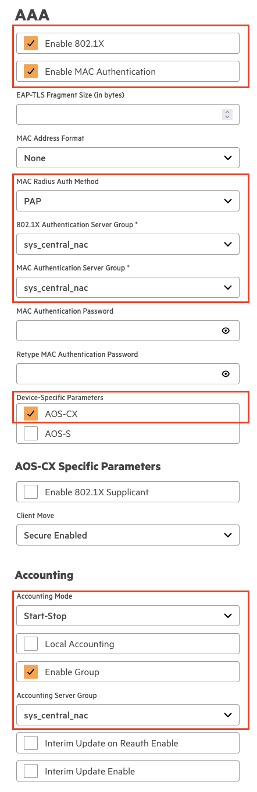
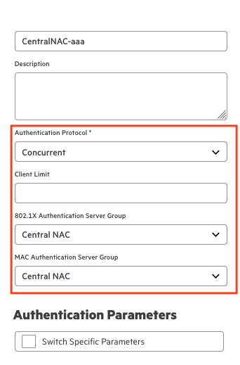
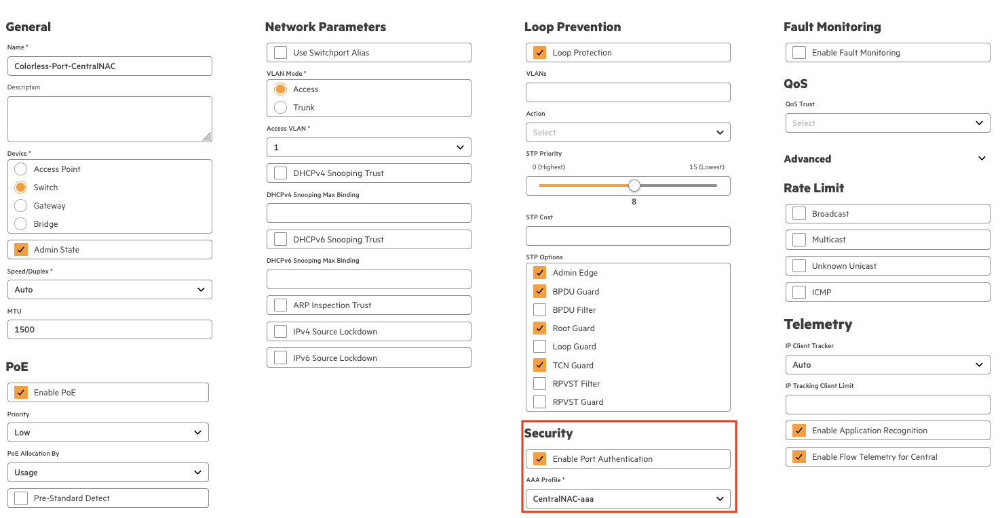
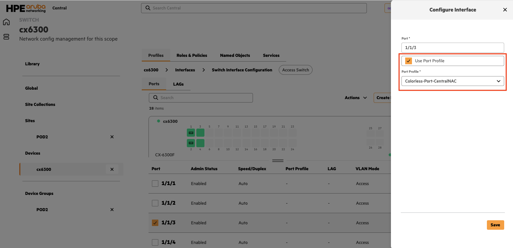
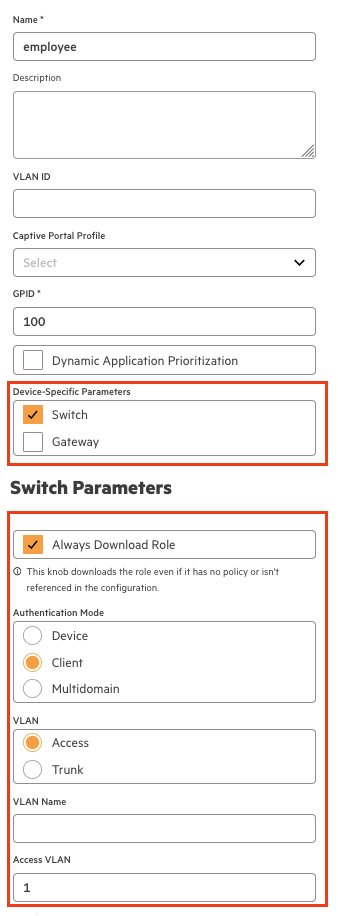
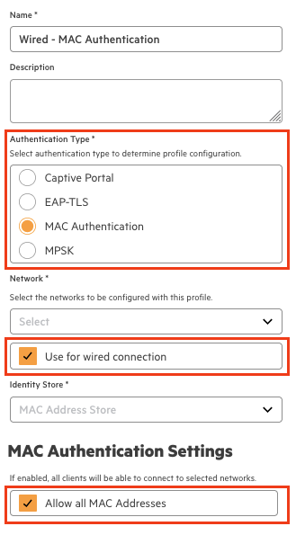
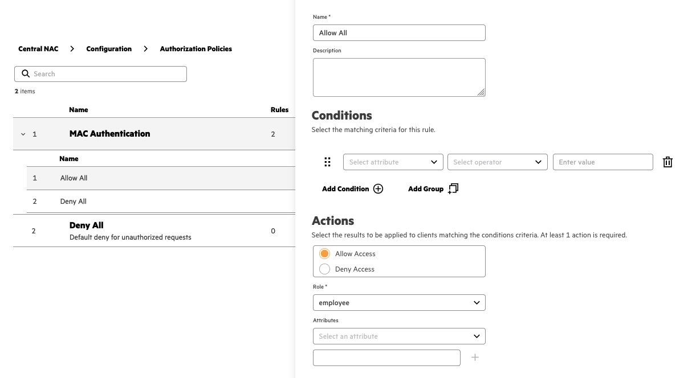
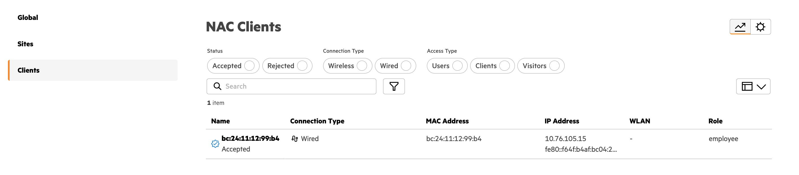
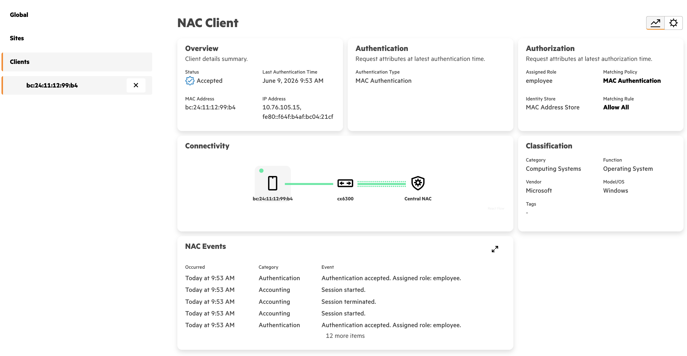

# Configure Aruba CX switches for Central NAC

  

## Table of contents

* [Overview](#overview)
* [Prerequisites](#prerequisites)
* [Configuration steps](#configuration-steps)
* [Switch configuration](#switch-configuration)
  * [Configure Switch System Profile](#configure-switch-system-profile)
  * [Configure AAA Profile](#configure-aaa-profile)
  * [Configure Port Profile](#configure-port-profile)
  * [Apply Port Profile to a switch interface](#apply-port-profile-to-a-switch-interface)
  * [Configure a Role](#configure-a-role)
* [Central NAC configuration](#central-nac-configuration)
  * [Configure Authentication Profile for MAC Authentication](#configure-authentication-profile-for-mac-authentication)
  * [Configure the Authorization Policy](#configure-the-authorization-policy)
* [Validation](#validation)
  * [Validation - Central NAC](#validation---central-nac)
  * [Switch validation commands](#switch-validation-commands)
* [Common issues](#common-issues)

## Overview

This how-to explains how to configure Aruba CX switches to connect to Central NAC.

In this example, an Aruba CX-6300 switch is used. The same steps apply to any other CX platform that supports 802.1x and MAC authentication.

> [!NOTE]
> This is not a full how-to; it focuses only on the AOS-CX switch configuration and some basic Central NAC configuration. For more information, refer to the following resources:

* <https://arubanetworking.hpe.com/techdocs/NAC/central-nac/>
* <https://arubanetworking.hpe.com/techdocs/new-central/content/nac/nac-overview.htm>

## Prerequisites

* Aruba CX switch managed in **Aruba Central**
* Minimum CX software version **AOS-CX 10.15**
* **TCP-PORT 2083** open between the switch and Central NAC for RadSec communication

## Configuration steps

The configuration consists of creating or updating the following profiles in Central.



1. System > Switch System

    Configures global switch configuration including 802.1x/MAC

2. Security > AAA profile

    Enable authentication protocols and the authentication server. This AAA profile will be used in the port profiles that are applied on the switch interfaces

3. Interfaces > port profile

    Map the created AAA profile to the port profile

4. Switch > interfaces

    Apply the port profile to one or more switch interfaces

> [!NOTE]
> This configuration guide only shows how to created the profiles. Details on how and where to apply the profiles in the scope are not configured.

For information about the configuration model within Aruba Central consult the HPE Networking VSG page:
<https://arubanetworking.hpe.com/techdocs/VSG/docs/002-central/central-020-config-model/>

## Switch configuration

### Configure Switch System Profile

Navigate to:

```text
Aruba Central → Configuration → System → Switch System
```

Create a new Switch System Profile (or edit an existing one) and assign the profile to the right *scope* and *Device Function*.
Configure the profile with the following information.

#### AAA section

| Parameter | Value |
| --- | --- |
| **Enable 802.1X** | ✓ |
| **Enable MAC Authentication** | ✓ |
| **MAC Radius Auth Method** | PAP |
| **802.1X Authentication Server Group** | sys_central_nac |
| **EAP-TLS** | 802.1X certificate-based authentication method |
| **Device-Specific Parameters** | ✓ → *This is to show additional parameters in the UI* |
| **Accounting** | Start-Stop |
| **Enable Group** | ✓ |
| **Accounting Server Group** | sys_central_nac |



#### Configuration Push Switch System Profile

The following configuration will be pushed to the switch. You can validate this in the *Aruba Central Audit Trail* or on the switch CLI.

```text
radius server-group sys_central_nac
    radius-server host naw2.cloudguest.central.arubanetworks.com tls port 2083 vrf default port-access keep-alive timeout
!
radius dyn-authorization client naw2.cloudguest.central.arubanetworks.com tls vrf default
!
aaa group server radius sys_central_nac
    server naw2.cloudguest.central.arubanetworks.com tls port 2083 vrf default
!
aaa radius-attribute group sys_central_nac
    nas-id value 'REMOVED'
    nas-id request-type both
!
aaa accounting port-access start-stop group sys_central_nac
!
aaa authentication port-access dot1x authenticator
    enable
    radius server-group sys_central_nac
!
aaa authentication port-access mac-auth
    enable
    auth-method pap
!
```

> [!TIP]
> The RADIUS server FQDN depends on the region where Aruba Central is deployed.

### Configure AAA Profile

Navigate to:

```text
Aruba Central → Configuration → Security → AAA Authentication
```

Create a new AAA Authentication Profile (or edit an existing one) and assign the profile to the right *scope* and *Device Function*.
This AAA profile is intended for use within a Port Profile. Assigning the profile alone does not trigger any configuration changes on the switch; changes occur only when it is applied through a Port Profile.

Configure the profile with the following information.

| Parameter | Value |
| --- | --- |
| **Authentication Protocol** | Concurrent |
| **802.1X Authentication Server Group** | Central NAC |
| **MAC Authentication Server Group** | Central NAC |

:::note
Aruba CX concurrent onboarding accelerates device connectivity by running 802.1X and MAC authentication in parallel instead of sequentially, reducing connection delays due to waiting on 802.1X.
Change the Authentication Protocol to any other method if you don't want to use the concurrent method.
:::



### Configure Port Profile

Navigate to:

```text
Aruba Central → Configuration → Security → AAA Authentication
```

Create a new Port Profile (or edit an existing one) and assign the profile to the right *scope* and *Device Function*.
A Port Profile is a template that contains configuration settings for a switch interface. It can be assigned to one or multiple interfaces.
Any updates made to the Port Profile are automatically propagated to all associated interfaces.
Assigning the profile alone does not trigger any configuration changes on the switch; changes occur only when it is referenced at interface level.

Configure the profile with the following information.

#### Security section

| Parameter | Value |
| --- | --- |
| **Enable Port Authentication** | ✓ |
| **AAA Profile** | CentralNAC-aaa (AAA profile created in the previous step) |



> [!NOTE]
> The screenshot above illustrates the Port Profile configuration. Besides the security configuration, it also includes loop prevention settings.
While these are not mandatory for Central NAC, it is considered best practice to enable them.

### Apply Port Profile to a switch interface

Navigate to:

```text
Aruba Central → Configuration → Switch Level → Switch Interface Configuration
```

The Port Profile is assigned at the switch device level. Select the desired interface and apply the Port Profile to it.
This action applies the previously configured template to the selected switch interface.

Configure the profile with the following information.

#### Apply Port Profile

| Parameter | Value |
| --- | --- |
| **Use Port Profile** | ✓ |
| **Port Profile** | Colorless-Port-CentralNAC (Port Profile created in the previous step) |



#### Configuration Push Port Profile

The following configuration will be pushed to the switch. You can validate this in the *Aruba Central Audit Trail* or on the switch CLI.
The configuration contains some additional configuration like spanning-tree and app-recognition. These configurations are not mandatory for Central NAC.

```text
interface 1/1/3
    no shutdown 
    no routing
    vlan access 1
    spanning-tree bpdu-guard
    spanning-tree root-guard
    spanning-tree tcn-guard
    spanning-tree port-type admin-edge
    port-access onboarding-method concurrent enable
    no aaa authentication port-access allow-lldp-auth
    no aaa authentication port-access allow-cdp-auth
    aaa authentication port-access radius-override enable
    aaa authentication port-access dot1x authenticator
        radius server-group sys_central_nac
        enable
    aaa authentication port-access mac-auth
        enable
        radius server-group sys_central_nac
    app-recognition enable
    ip flow monitor sys_cx_monitor_v4_default in
    ipv6 flow monitor sys_cx_monitor_v6_default in
    exit
```

### Configure a Role

Navigate to:

```text
Aruba Central → Configuration → Roles & Policies → Roles
```

Create a new Role and assign the profile to the right *scope* and *Device Function*.

A Role defines authorization attributes such as VLAN, authentication mode, PoE settings, and more.
This Role is returned by Central NAC during client authentication on the network.

The Role shown here is for demonstration purposes only. In production environments, multiple Roles are typically defined and used.

Configure the Role with the following information.

#### Employee Role

| Parameter | Value |
| --- | --- |
| **Device-Specific Parameters** | Switch |
| **Always Download Role** | ✓ |
| **Authentication Mode** | Client |
| **VLAN** | Client |
| **Access VLAN** | 1 |
| **Admin Edge Port** | ✓ |

> [!TIP]
> The ***Always Download Role*** knob downloads the role to the switch even if it has no policy or isn't referenced in the configuration. If not enabled the Role needs to be referenced in security policy.



#### Configuration Push Role

The following configuration will be pushed to the switch. You can validate this in the *Aruba Central Audit Trail* or on the switch CLI.

```text
port-access role employee
    auth-mode client-mode                                      
    stp-admin-edge-port 
    vlan access 1
```

## Central NAC configuration

While this guide focuses on the configuration of Aruba CX switches, the following outlines the minimum steps required within Central NAC. These steps are specifically focused on MAC authentication.

### Configure Authentication Profile for MAC Authentication

Navigate to:

```text
Aruba Central → Central NAC → Configuration → Authentication Profiles
```

Create a new Profile for MAC Authentication. Configure the profile with the following information.

#### MAC Authentication Profile

| Parameter | Value |
| --- | --- |
| **Authentication Type** | MAC Authentication |
| **Network** | *leave empty* |
| **Use for wired connection** | ✓ |
| **Allow all MAC Addresses** | ✓ |

> [!TIP]
> The ***Allow all MAC Addresses*** option is optional.
When enabled, all clients are permitted to authenticate, and successfully authenticated MAC addresses are automatically added to the MAC address store.
Authentication success still depends on the configured authorization policies.



### Configure the Authorization Policy

Navigate to:

```text
Aruba Central → Central NAC → Configuration → Authorization Policies
```

Authorization Policies define how devices are mapped to Roles based on specific conditions. These policies evaluate attributes and assign the appropriate Role to a device during authentication.

The conditions available within Authorization Policies depend on the Central NAC license.
Central NAC Core enables the configuration of basic policies, while Central NAC Pro provides greater flexibility and more advanced policy options.

Refer to the following resource for detailed information.

<https://arubanetworking.hpe.com/techdocs/NAC/central-nac/central-nac-understanding-foundation-vs-advanced-subscriptions/>

Configure the Authorization Policy with the following information.

| Parameter | Value |
| --- | --- |
| **Policy Type** | Client |
| **Authorization Context** | MAC Address Store (greyed out) |

#### Authorization Policy Rule

Add a new Rule to the created Authorization Policy. Configure the Rule with the following information.

| Parameter | Value |
| --- | --- |
| **Name** | Allow All |
| **Actions** | Allow Access |
| **Role** | employee |

> [!NOTE]
> This rule does not include any conditions and therefore acts as an allow-all rule.



## Validation

The required configuration steps are now done. Connect a client to the switch interface. The client should be authenticated via Central NAC and placed in Role employee.

### Validation - Central NAC

To view the client authentication requests and details. Navigate to:

```text
Aruba Central → Central NAC → Clients
```

This page shows all authentication requests in Central NAC.



Click on a client to view the authentication details.



### Switch validation commands

| Validation step | Command | Expected result |
| --- | --- | --- |
| **Validate if the Central NAC certificate is installed** | ```show crypto pki ta-profile sys_central_nac``` | Details about the Central NAC certificate |
| **Check if RadSec connection is up** | ```show radius-server detail``` | TLS status: tls_connection_established |
| **Show authenticated clients** | ```show port-access clients``` | One or more connected clients |

### Common issues

Hereby a list of common configuration related issues seen in the field

| Issue | Most likely cause |
| --- | --- |
| **RadSec connection down** | RadSec port TCP-2083 not allow from the switches to Central NAC |
| **Central NAC Certificate not installed** | Switch System profile not correctly assigned |
| **MAC authentication failure with unexpected data error** | [MAC Radius Auth Method not set to PAP](#aaa-section) |
